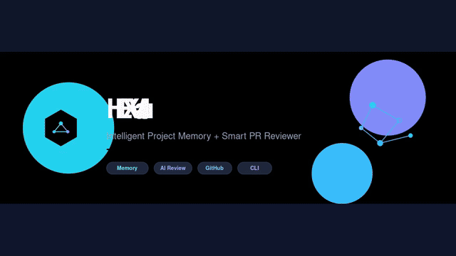

<p align="center">
  
</p>

<p align="center">
  <strong>Intelligent Project Memory Vault + Smart PR Reviewer</strong><br/>
  Your project remembers everything. Every PR gets smarter.
</p>

<p align="center">
  <a href="LICENSE"></a>
  <a href="package.json"></a>
  <a href="https://nodejs.org"></a>
  <a href=".github/workflows/hexvault-review.yml"></a>
  
  
</p>

---

## Why HEXVault?

Most AI coding tools forget everything between sessions.  
Most PR reviewers have **zero knowledge** of your past decisions, bug fixes, or architecture choices.

**HEXVault fixes both.**

| Capability | What you get |
|------------|----------------|
| **Project Memory Vault** | Decisions, bug fixes, architecture notes, patterns & security rules — stored locally in SQLite |
| **Smart PR Reviewer** | Context-aware reviews powered by your project memory + optional LLM |
| **GitHub Action** | Automatic review comments on every pull request |
| **CLI** | `init` · `add` · `search` · `list` · `stats` · `review` |
| **Multi-provider** | GitHub · GitLab · Bitbucket |
| **Dashboard** | Self-hosted web UI for browsing memories |
| **Team-ready** | Multi-repo linking · feedback learning · Slack/Discord notifications |

---

## Feature Matrix

| Feature | Status |
|---------|--------|
| Project Memory Vault (SQLite) | ✅ |
| Smart PR Reviewer (rule + AI) | ✅ |
| GitHub Action | ✅ |
| CLI | ✅ |
| LLM Providers (OpenAI / Grok / Anthropic / Ollama) | ✅ |
| Semantic-ish search (lightweight embeddings) | ✅ |
| Auto-ingest from merged PRs & commits | ✅ |
| Custom review rules | ✅ |
| Feedback learning (thumbs up/down) | ✅ |
| Slack / Discord notifications | ✅ |
| Multi-repo memory linking | ✅ |
| Self-hosted Dashboard | ✅ |
| VS Code / Cursor extension scaffold | ✅ |
| GitLab + Bitbucket providers | ✅ |

---

## Quick Start

```bash
# Clone
git clone https://github.com/sawon2026/HEXVault.git
cd HEXVault
npm install

# Initialize in any project
npx tsx src/cli/index.ts init

# Add your first memories
npx tsx src/cli/index.ts add "We use SQLite and never hardcode secrets" --type decision --tags security
npx tsx src/cli/index.ts add "Auth middleware must validate JWT expiry" --type architecture --files src/auth

# Search
npx tsx src/cli/index.ts search "auth"

# Local review demo
npx tsx src/cli/index.ts review --title "Add login flow"

# Open dashboard
npm run dashboard
# → http://localhost:3847
```

---

## Visual Setup Guide

Step-by-step screenshots (click to open):

| Step | Guide |
|------|--------|
| 1. Install & Init | [](docs/guides/SETUP.md) |
| 2. Add Memories | [](docs/guides/SETUP.md) |
| 3. GitHub Action (where to click) | [](docs/guides/SETUP.md) |
| 4. Dashboard | [](docs/guides/SETUP.md) |
| 5. CI/CD pipelines | [](docs/guides/SETUP.md) |

Full walkthrough: **[docs/guides/SETUP.md](docs/guides/SETUP.md)**

---


## Demo Video

Watch the full walkthrough (setup → memories → GitHub Actions → dashboard → CI/CD):

https://github.com/sawon2026/HEXVault/blob/main/assets/video/hexvault-demo.mp4



> 33-second guided tour of every major feature.

---

## CLI Reference

| Command | Description |
|---------|-------------|
| `hexvault init` | Initialize HEXVault in the current project |
| `hexvault add <text>` | Add a memory (`--type`, `--tags`, `--files`, `--title`) |
| `hexvault search <query>` | Search project memories |
| `hexvault list` | List recent memories |
| `hexvault stats` | Show memory statistics |
| `hexvault review` | Run a local review demo |

---

## Configuration

Create `.hexvault.yml` (auto-generated by `init`):

```yaml
memory:
  path: .hexvault/memory.db
  vector: true

review:
  model: rule-based          # rule-based | openai | anthropic | grok | ollama
  severity: medium
  checks:
    - security
    - consistency
    - best-practices
  customRules:
    - "Never use any in public TypeScript APIs"

llm:
  provider: rule-based
  apiKeyEnv: HEXVAULT_API_KEY

notifications:
  enabled: false
  channel: discord           # slack | discord | webhook
  webhookUrlEnv: HEXVAULT_WEBHOOK_URL

multiRepo:
  enabled: false
  configPath: .hexvault/multi-repo.json

ignore:
  - "**/*.test.ts"
  - "docs/**"
```

**Environment variables**

| Variable | Purpose |
|----------|---------|
| `HEXVAULT_API_KEY` / `OPENAI_API_KEY` | OpenAI-compatible API key |
| `XAI_API_KEY` | Grok (xAI) |
| `ANTHROPIC_API_KEY` | Claude |
| `HEXVAULT_WEBHOOK_URL` | Slack / Discord webhook |
| `HEXVAULT_DASHBOARD_PORT` | Dashboard port (default `3847`) |

---

## How It Works

```
┌─────────────────────┐         ┌──────────────────────────┐
│  Project Memory     │◄───────►│   Smart PR Reviewer      │
│  (SQLite + Vector)  │         │   (Rule + optional LLM)  │
└─────────┬───────────┘         └────────────┬─────────────┘
          │                                  │
   Auto-Ingest (PR/Commit)            GitHub Action / GitLab / Bitbucket
          │                                  │
          ▼                                  ▼
   Feedback Store                    Slack / Discord Notify
```

1. **Ingest** — manual CLI or auto from merged PRs/commits  
2. **Store** — SQLite + lightweight vector index  
3. **Retrieve** — keyword + semantic + file-based hybrid search  
4. **Review** — security heuristics + consistency with past decisions + optional LLM  
5. **Learn** — thumbs up/down feedback ranks future memory usage  
6. **Notify** — optional Slack/Discord on review complete  

---

## GitHub Action

Workflow is already included:

```
.github/workflows/hexvault-review.yml
```

It runs on `pull_request` (opened / synchronize / reopened) and posts a context-aware review comment.

---

## Dashboard

```bash
npm run dashboard
```

Clean dark UI showing memory counts, feedback stats, and recent entries.

---

## Architecture

See **[docs/architecture/overview.md](docs/architecture/overview.md)** for module map and data flow.

```
src/
├── core/
│   ├── memory/          # SQLite store
│   ├── review/          # Rule + AI reviewer
│   ├── llm/             # OpenAI / Grok / Anthropic / Ollama
│   ├── vector/          # Embeddings + search
│   ├── ingest/          # Auto-ingest
│   ├── feedback/        # Learning from votes
│   ├── notifications/   # Slack / Discord
│   └── multi-repo/      # Cross-repo linking
├── providers/           # GitHub · GitLab · Bitbucket
├── cli/
├── action/
├── dashboard/
└── extension/           # VS Code / Cursor scaffold
```

---

## Version History

| Version | Focus |
|---------|--------|
| **v0.1** | Foundation — Memory Vault, rule-based reviewer, CLI, GitHub Action |
| **v0.2** | Intelligence — LLM providers, embeddings, auto-ingest, AI reviews |
| **v0.3** | Scale — Multi-repo, custom rules, extension scaffold, feedback learning |
| **v0.4** | Ecosystem — Dashboard, notifications, GitLab & Bitbucket providers |

---

## Contributing

PRs are welcome. See [CONTRIBUTING.md](CONTRIBUTING.md).

1. Fork the repo  
2. Create a feature branch  
3. Add memories about your changes  
4. Open a PR — HEXVault will review it  

---

## Security

See [SECURITY.md](SECURITY.md) for reporting vulnerabilities.

---

## License

MIT © [sawon2026](https://github.com/sawon2026)

---

<p align="center">
  
  <br/>
  <sub><b>HEXVault</b> — Because your project deserves a memory, and every PR deserves context.</sub>
</p>
