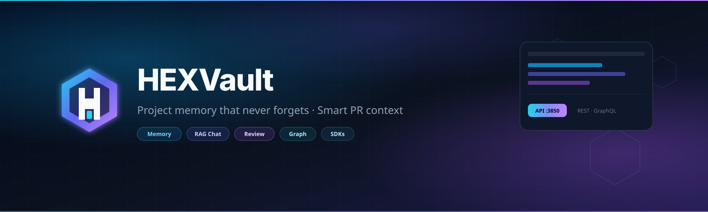
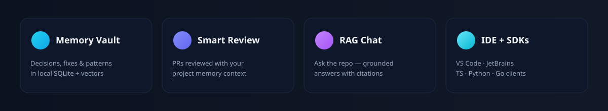
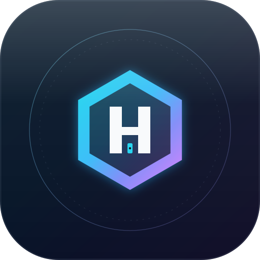

<p align="center">
  
</p>

<p align="center">
  
</p>

<p align="center">
  <strong>Intelligent Project Memory Vault + Smart PR Reviewer</strong><br/>
  Your project remembers everything. Every PR gets smarter.
</p>

<p align="center">
  <a href="LICENSE"></a>
  <a href="package.json"></a>
  <a href="https://nodejs.org"></a>
  <a href=".github/workflows/hexvault-review.yml"></a>
  
  
  
</p>

---

## Why HEXVault?

Most AI coding tools forget everything between sessions.  
Most PR reviewers have **zero knowledge** of your past decisions, bug fixes, or architecture choices.

**HEXVault fixes both.**

| Capability | What you get |
|------------|----------------|
| **Project Memory Vault** | Decisions, bug fixes, architecture notes — SQLite + vectors |
| **Hybrid Search** | Keyword + semantic ranking |
| **RAG Chat** | Grounded answers with citations |
| **Smart PR Reviewer** | Context-aware reviews · GitHub Action |
| **Multi-model LLMs** | OpenAI · Anthropic · Grok · Gemini · Ollama · more |
| **Knowledge Graph** | Interactive graph |
| **Webhooks & Notify** | HMAC webhooks · Slack / Discord / Teams / … |
| **Team sync** | Export/import · multi-repo |
| **Dashboards** | Next.js light/dark |
| **SDKs** | TypeScript · Go · Python |
| **IDE plugins** | VS Code (React + TanStack Query) · JetBrains |

**No API key required** for rule-based mode. Add keys when you want LLM power.

---

## Quick Start

```bash
npm install
npx hexvault init
npx hexvault add "We use SQLite" --type decision --tags db
npx hexvault search "auth"
npx hexvault ask "Which database?"
npm run api    # http://127.0.0.1:3850
npm run web    # http://localhost:3000
```

```bash
docker compose up --build
```

---

## IDE Extensions

**VS Code** — `packages/vscode-extension` (React webview + TanStack Query)  
**JetBrains** — `packages/jetbrains-plugin`

---

## Quality & docs

- [Audit](docs/AUDIT_WORLDCLASS.md) · [Quality scores](docs/QUALITY_REPORT.md) · [Diagrams](docs/architecture/diagrams.md)
- [Setup](docs/guides/SETUP.md) · [API](docs/api/REST.md) · [Code of Conduct](CODE_OF_CONDUCT.md)
- Brand assets: [assets/README.md](assets/README.md)

Production tip: set **`HEXVAULT_API_TOKEN`** if the API is not localhost-only.

---

## Contributing

[CONTRIBUTING.md](CONTRIBUTING.md) · [SECURITY.md](SECURITY.md) · MIT © [sawon2026](https://github.com/sawon2026)

---

<p align="center">
  
  <br/>
  <sub><b>HEXVault</b> — Because your project deserves a memory, and every PR deserves context.</sub>
</p>
