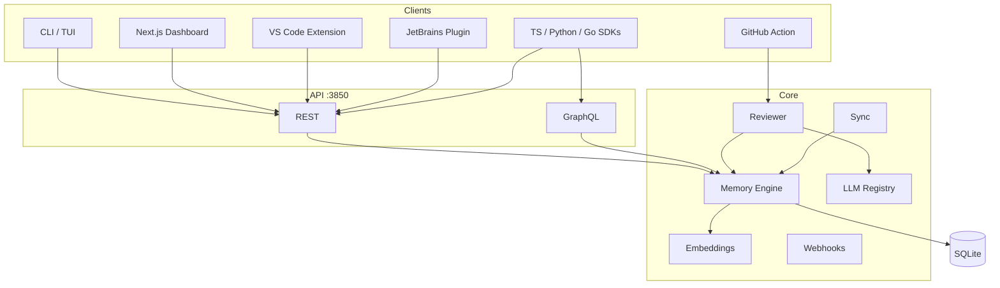
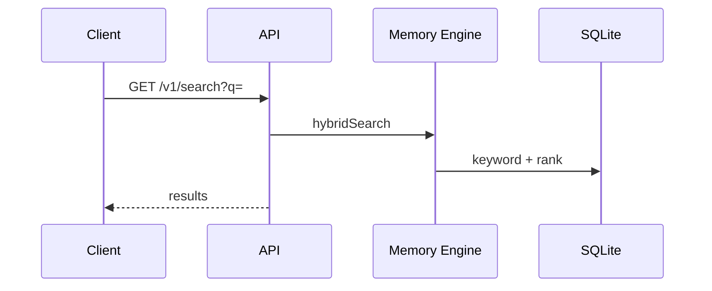
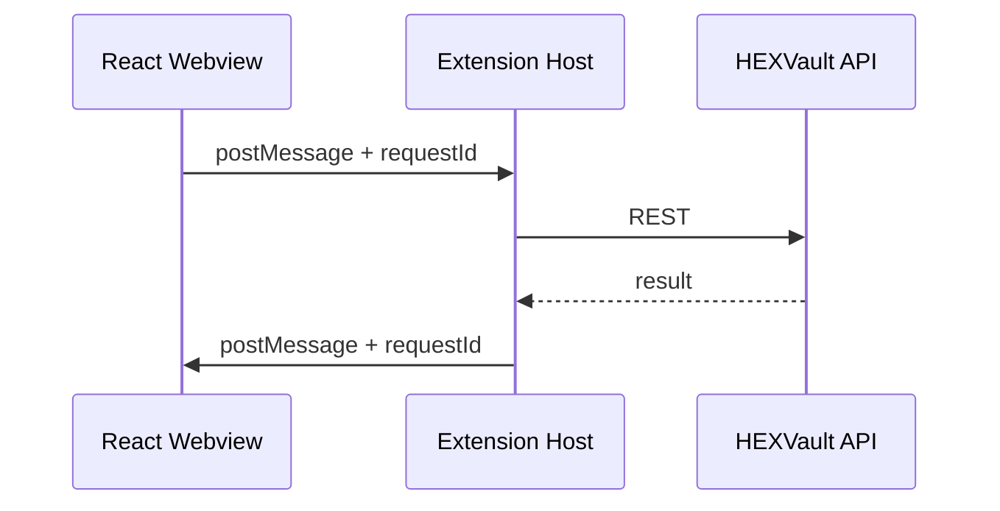
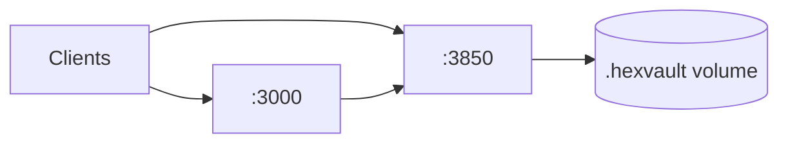

# HEXVault Architecture Diagrams

## System overview

```mermaid
flowchart TB
  subgraph Clients
    CLI[CLI / TUI]
    WEB[Next.js Dashboard]
    VSC[VS Code Extension]
    JB[JetBrains Plugin]
    SDK[TS / Python / Go SDKs]
    GHA[GitHub Action]
  end
  subgraph API["API :3850"]
    REST[REST]
    GQL[GraphQL]
  end
  subgraph Core
    MEM[Memory Engine]
    VEC[Embeddings]
    LLM[LLM Registry]
    REV[Reviewer]
    SYNC[Sync]
    WH[Webhooks]
  end
  DB[(SQLite)]
  CLI --> REST
  WEB --> REST
  VSC --> REST
  JB --> REST
  SDK --> REST
  SDK --> GQL
  GHA --> REV
  REST --> MEM
  GQL --> MEM
  MEM --> DB
  MEM --> VEC
  REV --> MEM
  REV --> LLM
  SYNC --> MEM
```

## Search sequence

```mermaid
sequenceDiagram
  participant U as Client
  participant A as API
  participant E as Memory Engine
  participant D as SQLite
  U->>A: GET /v1/search?q=
  A->>E: hybridSearch
  E->>D: keyword + rank
  A-->>U: results
```

## VS Code bridge

```mermaid
sequenceDiagram
  participant R as React Webview
  participant H as Extension Host
  participant A as HEXVault API
  R->>H: postMessage + requestId
  H->>A: REST
  A-->>H: result
  H->>R: postMessage + requestId
```

## Docker

```mermaid
flowchart LR
  U[Clients] --> WEB[:3000]
  U --> API[:3850]
  WEB --> API
  API --> VOL[(.hexvault volume)]
```
