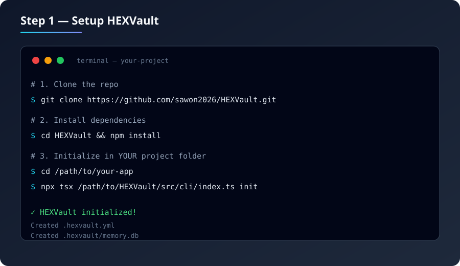
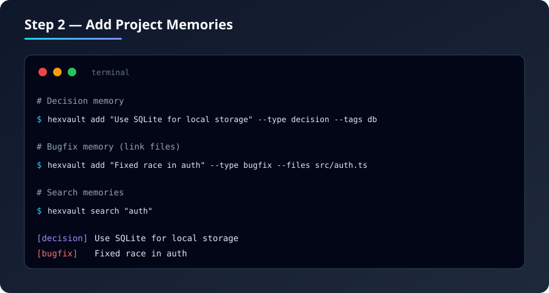
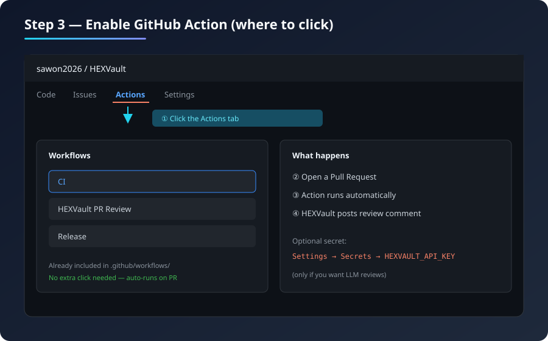
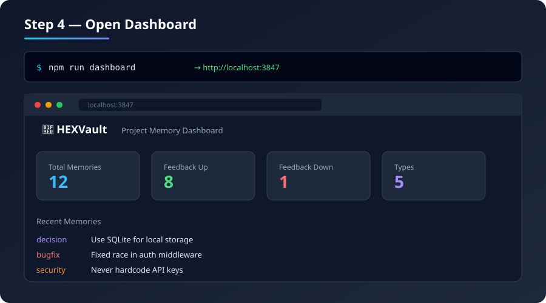
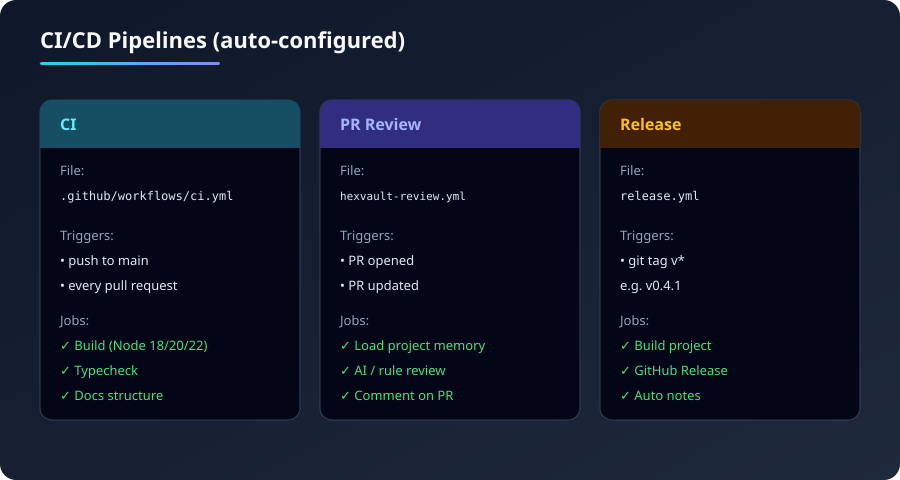

# HEXVault Visual Setup Guide

Follow these steps. Screenshots are in [`assets/guides/`](../../assets/guides/).

---

## Step 1 — Install & Init



```bash
git clone https://github.com/sawon2026/HEXVault.git
cd HEXVault && npm install

# In your app folder:
npx tsx /path/to/HEXVault/src/cli/index.ts init
```

This creates:
- `.hexvault.yml` — config
- `.hexvault/memory.db` — local memory database

---

## Step 2 — Add Memories



```bash
hexvault add "Use SQLite for local storage" --type decision --tags db
hexvault add "Fixed race in auth" --type bugfix --files src/auth.ts
hexvault search "auth"
```

**Types:** `decision` · `bugfix` · `architecture` · `pattern` · `security` · `note` · `api` · `refactor`

---

## Step 3 — GitHub Action (where to click)



1. Open your repo on GitHub  
2. Click the **Actions** tab (top menu)  
3. You will see workflows: **CI**, **HEXVault PR Review**, **Release**  
4. **No extra setup needed** — PR Review runs automatically when you open a PR  

**Optional (for LLM reviews):**  
`Settings` → `Secrets and variables` → `Actions` → New secret  
Name: `HEXVAULT_API_KEY` · Value: your API key

---

## Step 4 — Dashboard



```bash
npm run dashboard
# Open http://localhost:3847
```

Shows total memories, feedback scores, and recent entries.

---

## Step 5 — CI/CD Overview



| Workflow | File | When it runs |
|----------|------|----------------|
| **CI** | `ci.yml` | Every push & PR — build on Node 18/20/22 |
| **PR Review** | `hexvault-review.yml` | PR opened/updated — posts review comment |
| **Release** | `release.yml` | When you push a tag like `v0.4.1` |

### Create a release

```bash
git tag v0.4.1
git push origin v0.4.1
```

GitHub will create a Release automatically.
